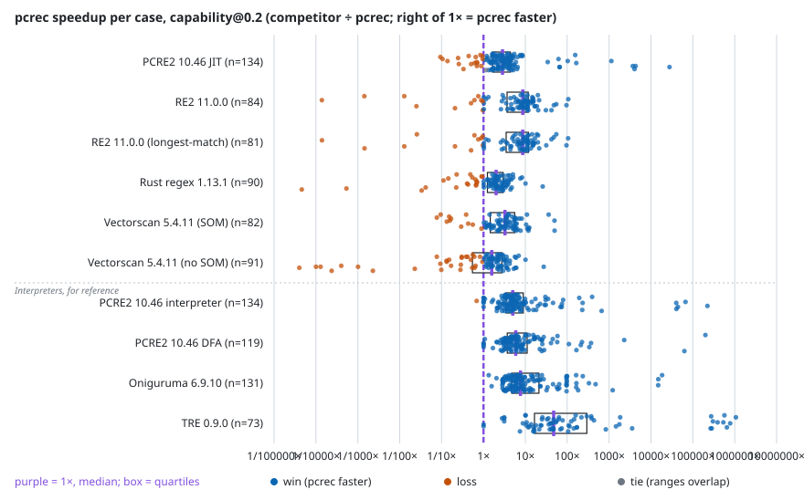

# pcrec-bench

pcrec-bench measures how fast regex engines really are on hard, realistic patterns: log parsing, input validation, security rules, backreferences, recursion, and inputs designed to make engines backtrack catastrophically. It compares [pcrec](https://github.com/fdicostanzo/pcrec), an ahead-of-time compiler that turns a regex into standalone C, against six widely used engines: PCRE2, RE2, Rust regex, Oniguruma, TRE and Vectorscan. A result only counts if the engine returned the correct answer, and compile time is reported separately rather than hidden.

## Headline

<!-- frontpage:headline:begin -->
On `capability@0.2` (142 pattern-regime cells), pcrec 0.2.0-beta+255bcdd8 (config `pcrec-auto`, measured 2026-10-08) is faster in 919 of 1019 compared cases (90.2%), tied in 1 (0.1%) and slower in 99 (9.7%); a further 401 pairs have no verified number on one side and are excluded (counted below). Competitors: 10 configurations of 6 engines (libpcre2, oniguruma, re2, rust, tre, vectorscan). Match time, compile excluded.[^rate]

[^rate]: Win rate = wins / (wins + losses + ties) over all competitor × case pairs; a case is one (pattern, regime) cell where both engines produced a verified number; a tie is overlapping [min, max] trial ranges. Competitor records were measured 2026-10-08 to 2026-10-09, pcrec's on 2026-10-08, all on one machine (`budu-ryzen1600`).
<!-- frontpage:headline:end -->

<!-- frontpage:table:begin -->
| Competitor | Kind | Cases | pcrec wins | Losses | Ties | Median speedup | Geo-mean speedup | Excluded |
|---|---|--:|--:|--:|--:|--:|--:|---|
| PCRE2 10.46 DFA | DFA | 119 | 119 | 0 | 0 | ×5.91 | ×8.92 | 23 (pcrec side: 4 unsupported or refused, 1 no oracle expectation to judge against; engine side: 4 wrong answer, 12 unsupported or refused, 2 not measured) |
| PCRE2 10.46 interpreter | interpreter (backtracking) | 134 | 133 | 1 | 0 | ×5.01 | ×8.83 | 8 (pcrec side: 4 unsupported or refused, 1 no oracle expectation to judge against; engine side: 3 gave up) |
| PCRE2 10.46 JIT | JIT | 134 | 116 | 17 | 1 | ×2.84 | ×3.54 | 8 (pcrec side: 4 unsupported or refused, 1 no oracle expectation to judge against; engine side: 3 gave up) |
| Oniguruma 6.9.10 | interpreter (backtracking) | 131 | 131 | 0 | 0 | ×7.66 | ×13.1 | 11 (pcrec side: 4 unsupported or refused, 1 no oracle expectation to judge against; engine side: 4 gave up, 2 unsupported or refused) |
| RE2 11.0.0 | automata (lazy DFA, NFA fallback) | 84 | 73 | 11 | 0 | ×8.71 | ×4.88 | 58 (pcrec side: 4 unsupported or refused, 1 no oracle expectation to judge against; engine side: 3 wrong answer, 50 unsupported or refused) |
| RE2 11.0.0 (longest-match) | automata (lazy DFA, NFA fallback) | 81 | 70 | 11 | 0 | ×8.65 | ×4.76 | 61 (pcrec side: 4 unsupported or refused, 1 no oracle expectation to judge against; engine side: 6 wrong answer, 50 unsupported or refused) |
| Rust regex 1.13.1 | automata (lazy DFA, PikeVM, bounded backtracker) | 90 | 71 | 19 | 0 | ×2.00 | ×1.39 | 52 (pcrec side: 4 unsupported or refused, 1 no oracle expectation to judge against; engine side: 3 wrong answer, 44 unsupported or refused) |
| TRE 0.9.0 | automata (POSIX tagged NFA; backtracking only for backreferences) | 73 | 73 | 0 | 0 | ×47.6 | ×159 | 69 (pcrec side: 4 unsupported or refused, 1 no oracle expectation to judge against; engine side: 7 wrong answer, 56 unsupported or refused, 1 not measured) |
| Vectorscan 5.4.11 (no SOM) | automata (SIMD multi-pattern) | 91 | 62 | 29 | 0 | ×1.57 | ×0.719 | 51 (pcrec side: 4 unsupported or refused, 1 no oracle expectation to judge against; engine side: 46 unsupported or refused) |
| Vectorscan 5.4.11 (SOM) | automata (SIMD multi-pattern) | 82 | 71 | 11 | 0 | ×3.26 | ×2.63 | 60 (pcrec side: 4 unsupported or refused, 1 no oracle expectation to judge against; engine side: 3 wrong answer, 52 unsupported or refused) |
| **all pairs** |  | 1019 | 919 | 99 | 1 | ×4.59 | ×5.66 |  |

Speedup = competitor median ÷ pcrec median, per case (> 1 means pcrec is faster); the median and geometric mean run over all of that engine's cases, ties included. Excluded cases are counted, never dropped silently; a pair failing on both sides is attributed to the pcrec side.
<!-- frontpage:table:end -->

<!-- frontpage:chart:begin -->

<!-- frontpage:chart:end -->

Each dot is one case (a pattern in one regime). Right of the dashed 1× line pcrec is faster. The box spans the quartiles of that engine's cases and the thick bar is the median.

## Explore the full results

[**Results viewer**](https://fdicostanzo.github.io/pcrec-bench/) is a static page over every measured set, engine, pattern and regime in the store: pick engines and sets, choose a metric, and the matrix re-renders in the browser. Cell values come from the same reduction code that produced the tables on this page. The viewer is a reading aid; the records under `store/` are the canonical data.

## Where pcrec loses

Taken from the same comparison as the table above, worst first, with nothing filtered out. A cause is shown only where a committed ledger or notes file states one, quoted with its source; otherwise it says "cause not yet analysed".

On this run the largest losses are the end-anchored patterns added in capability@0.2 (`\w+\z`, `[a-z]+\.txt$`, `\s+$` and their kin over 1 MiB of prose). An engine that can start an end-anchored search from the end of the subject touches only the tail; an engine that scans forward pays for the whole megabyte. pcrec scans forward here: reverse search for end-anchored patterns is a filed, not yet implemented pcrec work item (`[OPT-REVEND]`).

<!-- frontpage:losses:begin -->
The 20 worst of 99 losing cases across all competitors (pcrec slower, trial ranges disjoint; "slower by" is pcrec median ÷ competitor median), grouped by pattern family; families ordered by their worst case. Vectorscan's `nosom` configuration reports only match or no match and its driver stops at the first match (testees/vectorscan/CLAUDE.md), so on a subject that matches it does less work than an engine that reports a span; read its rows with that in mind.

**wild-logparse**

| Pattern | Regime | Engine | pcrec slower by | Why |
|---|---|---|--:|---|
| `tail-word-eoz` | large-subject-throughput | Vectorscan 5.4.11 (no SOM) | ×24,900 | "engines that scan forward pay the megabyte, an engine that can anchor at the end pays the tail" ([bench/capability/NOTES.md](bench/capability/NOTES.md)) |
| `tail-ext-lower-txt` | large-subject-throughput | Rust regex 1.13.1 | ×21,900 | "engines that scan forward pay the megabyte, an engine that can anchor at the end pays the tail" ([bench/capability/NOTES.md](bench/capability/NOTES.md)) |
| `tail-ext-lower-txt` | large-subject-throughput | Vectorscan 5.4.11 (no SOM) | ×9,970 | "engines that scan forward pay the megabyte, an engine that can anchor at the end pays the tail" ([bench/capability/NOTES.md](bench/capability/NOTES.md)) |
| `tail-space-eol` | large-subject-throughput | Vectorscan 5.4.11 (no SOM) | ×7,760 | "engines that scan forward pay the megabyte, an engine that can anchor at the end pays the tail" ([bench/capability/NOTES.md](bench/capability/NOTES.md)) |
| `tail-ext-lower-txt` | large-subject-throughput | RE2 11.0.0 | ×7,240 | "engines that scan forward pay the megabyte, an engine that can anchor at the end pays the tail" ([bench/capability/NOTES.md](bench/capability/NOTES.md)) |
| `tail-ext-lower-txt` | large-subject-throughput | RE2 11.0.0 (longest-match) | ×7,190 | "engines that scan forward pay the megabyte, an engine that can anchor at the end pays the tail" ([bench/capability/NOTES.md](bench/capability/NOTES.md)) |
| `tail-digits-eol` | large-subject-throughput | Vectorscan 5.4.11 (no SOM) | ×4,230 | "engines that scan forward pay the megabyte, an engine that can anchor at the end pays the tail" ([bench/capability/NOTES.md](bench/capability/NOTES.md)) |
| `tail-dotstar-txt` | large-subject-throughput | Rust regex 1.13.1 | ×1,880 | "engines that scan forward pay the megabyte, an engine that can anchor at the end pays the tail" ([bench/capability/NOTES.md](bench/capability/NOTES.md)) |
| `tail-dotstar-txt` | large-subject-throughput | Vectorscan 5.4.11 (no SOM) | ×990 | "engines that scan forward pay the megabyte, an engine that can anchor at the end pays the tail" ([bench/capability/NOTES.md](bench/capability/NOTES.md)) |
| `tail-dotstar-txt` | large-subject-throughput | RE2 11.0.0 | ×698 | "engines that scan forward pay the megabyte, an engine that can anchor at the end pays the tail" ([bench/capability/NOTES.md](bench/capability/NOTES.md)) |
| `tail-dotstar-txt` | large-subject-throughput | RE2 11.0.0 (longest-match) | ×691 | "engines that scan forward pay the megabyte, an engine that can anchor at the end pays the tail" ([bench/capability/NOTES.md](bench/capability/NOTES.md)) |
| `tail-word-eoz` | large-subject-throughput | RE2 11.0.0 | ×77.7 | "engines that scan forward pay the megabyte, an engine that can anchor at the end pays the tail" ([bench/capability/NOTES.md](bench/capability/NOTES.md)) |
| `tail-word-eoz` | large-subject-throughput | RE2 11.0.0 (longest-match) | ×77.6 | "engines that scan forward pay the megabyte, an engine that can anchor at the end pays the tail" ([bench/capability/NOTES.md](bench/capability/NOTES.md)) |
| `letters-bounded-tail-z` | large-subject-throughput | Vectorscan 5.4.11 (no SOM) | ×43.6 | cause not yet analysed |
| `tail-word-eoz` | large-subject-throughput | Rust regex 1.13.1 | ×29.9 | "engines that scan forward pay the megabyte, an engine that can anchor at the end pays the tail" ([bench/capability/NOTES.md](bench/capability/NOTES.md)) |
| `tail-space-eol` | large-subject-throughput | Rust regex 1.13.1 | ×24.0 | "engines that scan forward pay the megabyte, an engine that can anchor at the end pays the tail" ([bench/capability/NOTES.md](bench/capability/NOTES.md)) |

**semantics-divergence**

| Pattern | Regime | Engine | pcrec slower by | Why |
|---|---|---|--:|---|
| `wild-semdiv-empty-alt-repeat-pcre2` | large-subject-throughput | Vectorscan 5.4.11 (no SOM) | ×2,490 | cause not yet analysed |
| `keyword-prefix-order` | large-subject-throughput | Vectorscan 5.4.11 (no SOM) | ×438 | cause not yet analysed |

**wild-datetime**

| Pattern | Regime | Engine | pcrec slower by | Why |
|---|---|---|--:|---|
| `wild-datetime-moment-iso8601` | large-subject-throughput | RE2 11.0.0 | ×39.8 | cause not yet analysed |
| `wild-datetime-moment-iso8601` | large-subject-throughput | RE2 11.0.0 (longest-match) | ×38.9 | cause not yet analysed |

Losses by family, over every case:

| Family | Cases | Losses | Loss rate |
|---|--:|--:|--:|
| wild-waf | 95 | 21 | 22.1% |
| wild-datetime | 20 | 4 | 20.0% |
| semantics-divergence | 108 | 19 | 17.6% |
| wild-logparse | 235 | 25 | 10.6% |
| binary-nonutf8 | 41 | 4 | 9.8% |
| wild-codegrammar | 112 | 9 | 8.0% |
| wild-secrets | 78 | 5 | 6.4% |
| cap-lookaround | 32 | 2 | 6.2% |
| cap-backref | 35 | 2 | 5.7% |
| wild-validator | 120 | 5 | 4.2% |
| cap-recursion | 30 | 1 | 3.3% |
| redos-nested | 93 | 2 | 2.2% |
| floor | 20 | 0 | 0.0% |
<!-- frontpage:losses:end -->

<details>
<summary><strong>Second look: the other sets</strong> (click to expand)</summary>

The same metric, for the latest `pcrec-auto` record against each competitor's latest record on each other set in the store. Pin and date are shown per row because these records were not all measured in one window.

<!-- frontpage:othersets:begin -->
| Set | Competitor | pcrec-auto (pin, date) | Competitor date | Cases | Wins | Losses | Ties | Median speedup | Excluded |
|---|---|---|---|--:|--:|--:|--:|--:|---|
| `email-specimen@0.2` | PCRE2 10.46 interpreter | c4c70f2c (2026-10-05) | 2026-09-02 | 6 | 6 | 0 | 0 | ×17.6 | 3 (engine side: 3 not measured) |
| `email-specimen@0.2` | PCRE2 10.46 JIT | c4c70f2c (2026-10-05) | 2026-09-02 | 5 | 5 | 0 | 0 | ×2.58 | 4 (engine side: 4 not measured) |
| `email-specimen@0.2` | Rust regex 1.13.1 | c4c70f2c (2026-10-05) | 2026-09-20 | 6 | 5 | 1 | 0 | ×1.82 | 3 (engine side: 3 unsupported or refused) |
| `loglines@0.1` | PCRE2 10.46 interpreter | c4c70f2c (2026-10-05) | 2026-09-02 | 22 | 20 | 2 | 0 | ×9.92 | 0 |
| `loglines@0.1` | PCRE2 10.46 JIT | c4c70f2c (2026-10-05) | 2026-09-02 | 22 | 14 | 7 | 1 | ×1.65 | 0 |
| `loglines@0.1` | Rust regex 1.13.1 | c4c70f2c (2026-10-05) | 2026-09-20 | 22 | 13 | 9 | 0 | ×1.24 | 0 |
| `bounded@0.3` | PCRE2 10.46 interpreter | c4c70f2c (2026-10-05) | 2026-09-04 | 84 | 83 | 1 | 0 | ×5.88 | 45 (pcrec side: 3 unsupported or refused; engine side: 42 not measured) |
| `bounded@0.3` | PCRE2 10.46 JIT | c4c70f2c (2026-10-05) | 2026-09-05 | 84 | 68 | 15 | 1 | ×2.36 | 45 (pcrec side: 3 unsupported or refused; engine side: 42 not measured) |
| `bounded@0.3` | Rust regex 1.13.1 | c4c70f2c (2026-10-05) | 2026-09-20 | 120 | 109 | 10 | 1 | ×4.55 | 9 (pcrec side: 3 unsupported or refused; engine side: 6 unsupported or refused) |
| `altwide@0.2` | PCRE2 10.46 interpreter | 751b9c6d (2026-09-27) | 2026-09-03 | 60 | 60 | 0 | 0 | ×728 | 39 (pcrec side: 9 unsupported or refused, 1 not measured; engine side: 29 not measured) |
| `altwide@0.2` | PCRE2 10.46 JIT | 751b9c6d (2026-09-27) | 2026-09-03 | 60 | 60 | 0 | 0 | ×49.7 | 39 (pcrec side: 9 unsupported or refused, 1 not measured; engine side: 29 not measured) |
| `altwide@0.2` | Rust regex 1.13.1 | 751b9c6d (2026-09-27) | 2026-09-20 | 89 | 49 | 40 | 0 | ×1.12 | 10 (pcrec side: 9 unsupported or refused, 1 not measured) |
| `syntax@0.1` | PCRE2 10.46 interpreter | c4c70f2c (2026-10-05) | 2026-09-07 | 163 | 161 | 1 | 1 | ×4.95 | 109 (pcrec side: 2 wrong answer, 3 gave up, 24 unsupported or refused; engine side: 80 not measured) |
| `syntax@0.1` | PCRE2 10.46 JIT | c4c70f2c (2026-10-05) | 2026-09-07 | 163 | 113 | 50 | 0 | ×2.35 | 109 (pcrec side: 2 wrong answer, 3 gave up, 24 unsupported or refused; engine side: 80 not measured) |
| `syntax@0.1` | Rust regex 1.13.1 | c4c70f2c (2026-10-05) | 2026-09-20 | 130 | 95 | 31 | 4 | ×2.06 | 142 (pcrec side: 2 wrong answer, 3 gave up, 24 unsupported or refused; engine side: 17 wrong answer, 96 unsupported or refused) |
| `utf8@0.1` | PCRE2 10.46 DFA UTF-8 | c4c70f2c (2026-10-05) | 2026-09-26 | 137 | 137 | 0 | 0 | ×7.24 | 13 (pcrec side: 12 unsupported or refused; engine side: 1 wrong answer) |
| `utf8@0.1` | PCRE2 10.46 interpreter UTF-8 | c4c70f2c (2026-10-05) | 2026-09-26 | 138 | 138 | 0 | 0 | ×8.21 | 12 (pcrec side: 12 unsupported or refused) |
| `utf8@0.1` | PCRE2 10.46 JIT UTF-8 | c4c70f2c (2026-10-05) | 2026-09-26 | 138 | 137 | 1 | 0 | ×4.72 | 12 (pcrec side: 12 unsupported or refused) |
| `utf8@0.1` | Oniguruma 6.9.10 UTF-8 | c4c70f2c (2026-10-05) | 2026-09-26 | 119 | 118 | 1 | 0 | ×9.54 | 31 (pcrec side: 12 unsupported or refused; engine side: 5 wrong answer, 14 unsupported or refused) |
| `utf8@0.1` | RE2 11.0.0 UTF-8 | c4c70f2c (2026-10-05) | 2026-09-26 | 122 | 116 | 5 | 1 | ×8.85 | 28 (pcrec side: 12 unsupported or refused; engine side: 6 wrong answer, 10 unsupported or refused) |
| `utf8@0.1` | Rust regex 1.13.1 | c4c70f2c (2026-10-05) | 2026-09-26 | 114 | 94 | 20 | 0 | ×2.49 | 36 (pcrec side: 12 unsupported or refused; engine side: 4 wrong answer, 20 unsupported or refused) |
| `utf8@0.1` | Vectorscan 5.4.11 (no SOM) UTF-8 | c4c70f2c (2026-10-05) | 2026-09-26 | 126 | 77 | 48 | 1 | ×1.53 | 24 (pcrec side: 12 unsupported or refused; engine side: 2 wrong answer, 10 unsupported or refused) |
| `litrun@0.1` | PCRE2 10.46 JIT | c4c70f2c (2026-10-05) | 2026-09-28 | 28 | 19 | 8 | 1 | ×1.76 | 14 (engine side: 14 not measured) |

- `email-specimen@0.2`: competitors measured: libpcre2, rust.
- `loglines@0.1`: competitors measured: libpcre2, rust.
- `bounded@0.3`: competitors measured: libpcre2, rust.
- `altwide@0.2`: competitors measured: libpcre2, rust.
- `syntax@0.1`: competitors measured: libpcre2, rust.
- `utf8@0.1`: competitors measured: libpcre2, oniguruma, re2, rust, vectorscan.
- `litrun@0.1`: competitors measured: libpcre2.
<!-- frontpage:othersets:end -->

</details>

## Methodology

Short version; the full text, with the engine, hardware and compile-cost tables, is in [docs/methodology.md](docs/methodology.md).

- **What is timed.** Match time and compile time are separate axes. The headline is match time with compile excluded. Compile cost is reported separately in [docs/methodology.md](docs/methodology.md#compile-cost), and for pcrec it is large because compiling runs a C compiler.
- **Cases.** One case is one pattern in one regime (short-subject search, large-subject throughput), reduced over every subject of that regime. The set-grain arithmetic is `pcrecbench/reduce.py`, shared with the reporter.
- **Trials.** Five trials per cell, median with min and max. A tie means the two engines' min-max trial ranges overlap. Records are produced only after a quiet-box pre-flight and a trial-agreement check.
- **Correctness.** Every expected answer comes from libpcre2 as the oracle. A cell where an engine answers wrongly, gives up, or does not support the pattern gets no number: it is left out of the comparison and counted in the Excluded column.
- **Semantics differ by engine.** RE2 in `longest` mode and TRE are leftmost-longest (TRE is POSIX), Vectorscan in its `nosom` configuration reports only match or no match. Their expectations and caveats are in the methodology page.

### Fairness

Ahead-of-time compilation has an inherent advantage on these numbers. pcrec turns a pattern that is known before the program runs into C that a C compiler then optimises with the pattern's structure fixed; an engine that receives its pattern at runtime cannot specialise that far. Because the headline excludes compile time, that specialisation counts in pcrec's favour, and the cost of getting it (a C compiler run per pattern) is shown separately in the [compile-cost table](docs/methodology.md#compile-cost), where pcrec is the slowest engine in the table by a wide margin.

The closest like-for-like rows are the engines that also build a specialised matcher before matching: PCRE2 JIT, which emits machine code at runtime, and RE2, Rust `regex` and Vectorscan, which build automata at runtime. The interpreters (PCRE2's interpreter and DFA matcher, Oniguruma, TRE) are in the table for reference; pcrec's margin over them is the larger and less informative one.

## Reproduce

```sh
python3 -m venv .venv && .venv/bin/pip install -r requirements.txt
python3 -m pcrecbench testees                                  # configured engines
python3 -m pcrecbench run --subbench capability --testee pcre2-jit --trials 5
python3 -m pcrecbench index
make frontpage      # regenerate this page's tables, chart and provenance from store/
make viewer-data    # regenerate the viewer's data files
```

Engine build prerequisites are listed by `make deps`. Every number on this page is listed with its source record in [docs/frontpage_provenance.tsv](docs/frontpage_provenance.tsv).

## Status

pcrec is at 0.2.0-beta; the pinned commit measured here is main after that tag, not a release. Optimization work on pcrec is ongoing and driven by this benchmark, so results change. This page shows the latest run only.

## How it was built

pcrec-bench was built by directed AI agents (Claude) as a sibling project of pcrec; see pcrec's [APPROACH.md](https://github.com/fdicostanzo/pcrec/blob/main/APPROACH.md). The design record is in [APPROACH.md](APPROACH.md) and `docs/`.

License: MIT ([LICENSE](LICENSE)).
